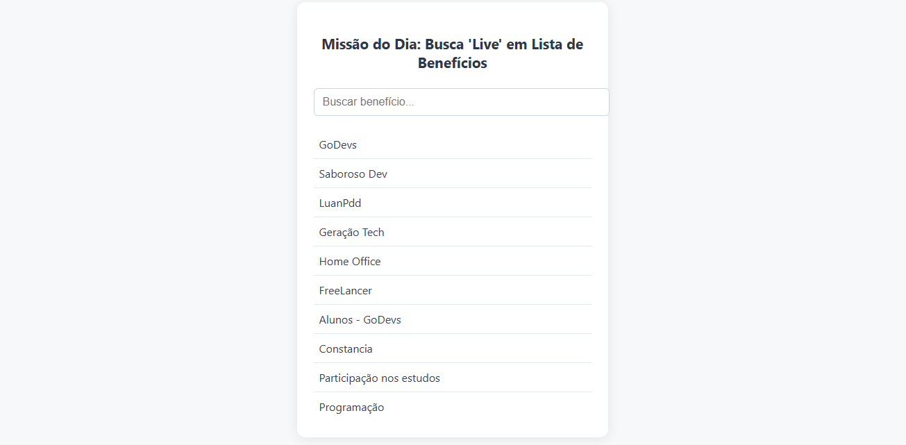
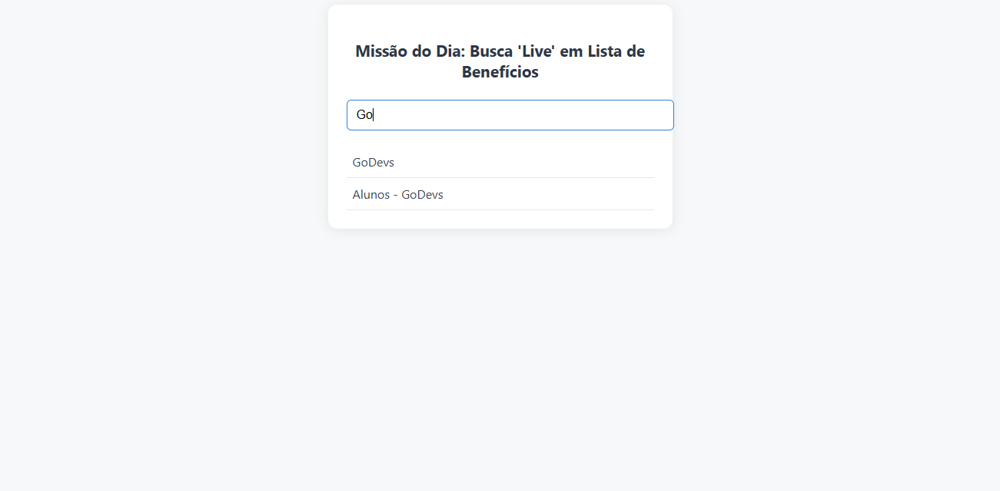

# Busca 'Live' em Lista de Benefícios


---

## 📋 Descrição

Este projeto é uma aplicação web simples e eficiente para busca instantânea ('live search') em uma lista de benefícios. O usuário pode digitar no campo de busca e ver, em tempo real, a filtragem dos itens exibidos na tela, tornando a experiência de navegação mais dinâmica e intuitiva.

---

## 🚀 Funcionalidades

- Campo de busca com filtro instantâneo
- Lista de pelo menos 10 benefícios
- Oculta itens que não correspondem ao termo buscado
- Visual moderno e responsivo

---

## 🖼️ Capturas de Tela

<p align="center">
  
  
</p>

---

## 📦 Estrutura do Projeto

```
├─ index.html
├─ css/
│  └─ style.css
├─ js/
│  └─ script.js
├─ assets/
│  └─ captura1.png
│  └─ captura2.png
└─ README.md
```

---

## ⚙️ Requisitos

- Navegador web moderno (Chrome, Firefox, Edge, etc.)
- Não é necessário backend ou instalação de dependências

---

## ▶️ Como Usar

1. Faça o download ou clone este repositório.
2. Abra o arquivo `index.html` em seu navegador.
3. Digite no campo de busca para filtrar os benefícios em tempo real.

---

## 👨‍💻 Desenvolvedor

**Guilherme Queiroz (Guielihan)**

<div style="display: flex; gap: 10px; flex-wrap: wrap;">
  <a href="https://discord.com/users/1297971679737413632">
    
  </a>
  <a href="https://www.instagram.com/devguielihan/">
    
  </a>
  <a href="mailto:devguielihan@gmail.com">
    
  </a>
</div>

### 🎓 Agradecimentos e Referências

<div style="display: flex; gap: 10px; flex-wrap: wrap;">
  <a href="https://github.com/in100tiva">
    
  </a>
  <a href="https://godevs.in100tiva.com/">
    
  </a>
</div>

---

<p align="center">
  Feito com 💙 por Guielihan
</p>